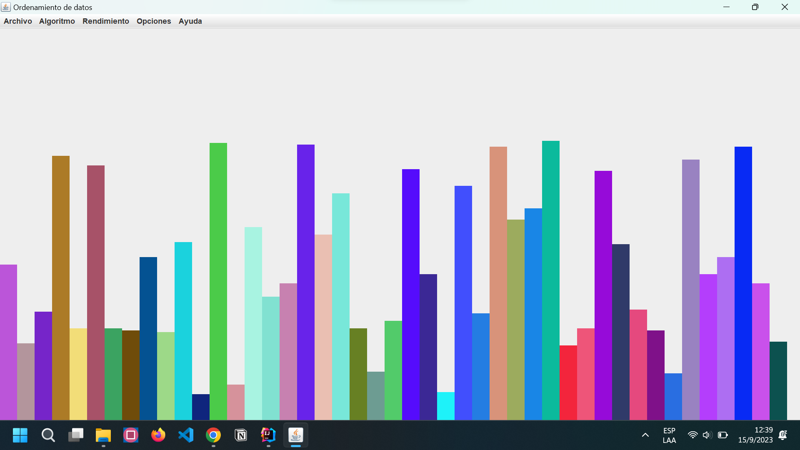

# sOrTinG Order
proyecto de prueba para poner en conocimiento el uso de los diferentes algoritmos de ordenamiento. **realizado 100% en java**.

## Getting Started
[ejemplo](src/vmedia/sourcevi.mp4)



> el proyecto esta  realizado con intellij idea, pero puede ser ejecutado con cualquier ide o editor de texto que soporte java.


### Prerequisites
* java 8
* intellij idea (opcional)
* git (opcional)
* maven (opcional)
### comandos
```bash
git clone https://github.com/DanRyzer10/project1.git
```
# les deseo un feliz dia 😃


